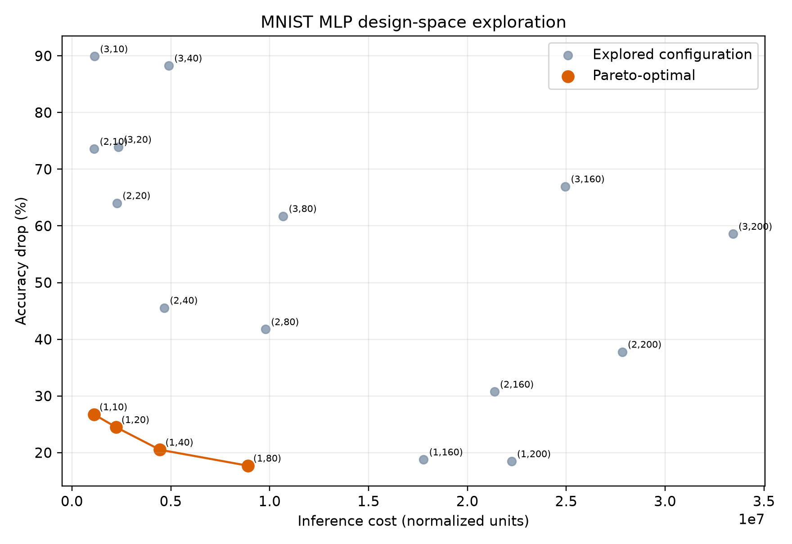

# ELCT918 Lab 1

This lab tests different fully connected neural networks on the MNIST digit dataset. The aim is to compare accuracy with the cost of using each network.

## Files and folders

```text
lab1_dse.py       Main PyTorch code
data/             MNIST dataset files
results/          CSV results and the Pareto plot
README.md         How to run the lab
```

Inside `results/`:

```text
results.csv          Results for all 18 networks
pareto_front.csv     Non-dominated networks
pareto_front.png    Plot of cost vs accuracy drop
```

## Requirements

Python 3.10 or newer with:

```text
torch
numpy
matplotlib
```

Install them with:

```bash
python -m pip install torch numpy matplotlib
```

## How to run

Run this command from inside the `LAB1` folder:

```bash
python lab1_dse.py --epochs 2 --batch-size 256 --lr 0.01
```

The code downloads MNIST automatically if the files are not already in `data/`. It trains all 18 networks and saves the results in `results/`.

## Design space

The networks have this form:

```text
784 → hidden layers → 10 outputs
```

The code tests:

```text
Hidden layers: 1, 2, 3
Nodes per hidden layer: 10, 20, 40, 80, 160, 200
```

This gives 18 different networks. All networks use the same dataset, number of epochs, batch size, learning rate, ReLU activation, cross-entropy loss, and SGD optimizer.

## Cost model

The cost follows the equation used in the assignment:

```text
cost = (number of weights × 139) + (number of multiplications × 1)
```

For a fully connected layer, the number of weights and multiplications is:

```text
input size × output size
```

## Pareto plot

The Pareto front contains networks that are not both more expensive and less accurate than another tested network.



## Picked configurations

The configurations on the Pareto front are:

```text
(1 layer, 10 nodes)   cost: 1,111,600   accuracy: 73.25%   accuracy drop: 26.75%
(1 layer, 20 nodes)   cost: 2,223,200   accuracy: 75.50%   accuracy drop: 24.50%
(1 layer, 40 nodes)   cost: 4,446,400   accuracy: 79.49%   accuracy drop: 20.51%
(1 layer, 80 nodes)   cost: 8,892,800   accuracy: 82.30%   accuracy drop: 17.70%
```

These are the picked configurations because none of them is both cheaper and more accurate than another tested configuration.
